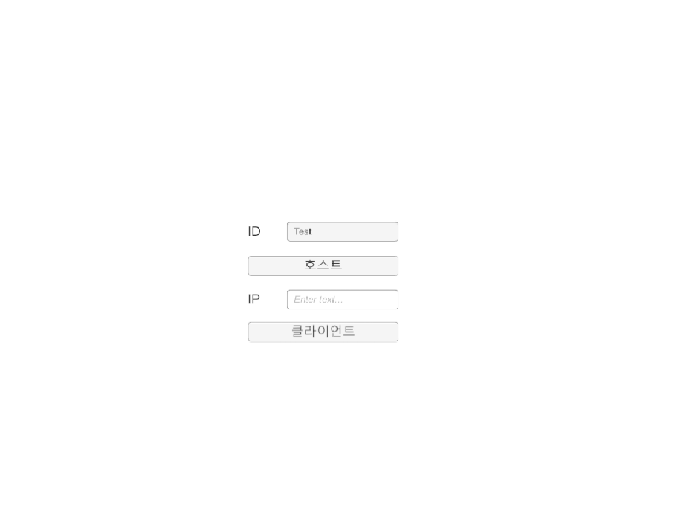
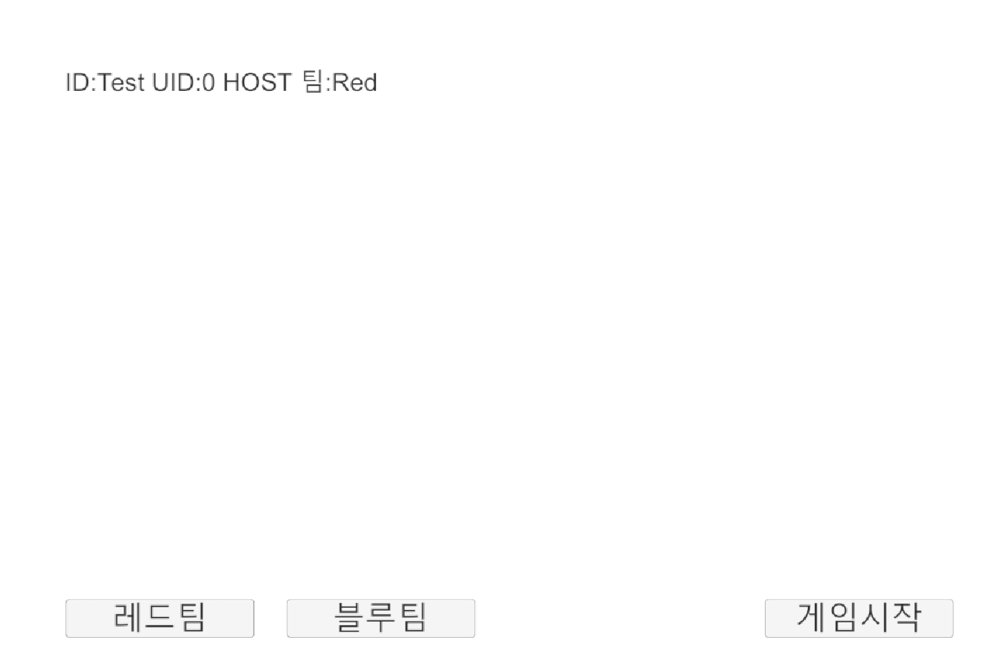
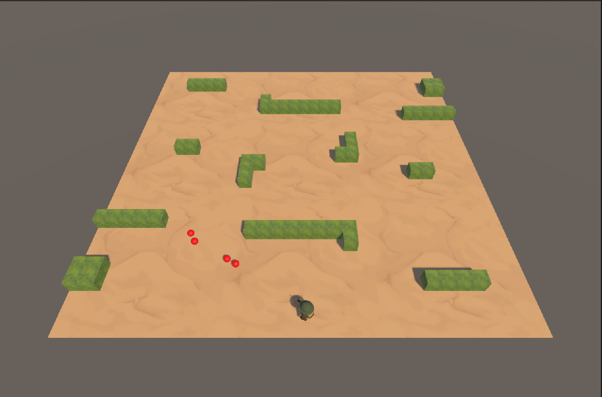

# NetWorkGame 기반 팀 대 팀 슈팅 게임

## 소개
이 프로젝트는 **Unity**와 **Win Socket**을 활용하여 **팀 대 팀** 구조의 실시간 슈팅 게임을 구현한 프로젝트입니다.  
**Host-Server 구조**를 채택하여 중앙 서버와 팀 간의 데이터를 효과적으로 동기화하며,  
**로비, 팀 선택, 캐릭터 이동, 슈팅 동작** 등 멀티플레이 환경을 제공하는 기능을 포함하고 있습니다.

---

## 주요 기능
### **1. 로비 및 팀 선택**
- 플레이어가 접속 후 팀을 선택할 수 있는 로비 시스템 구현.
- 팀 매칭 시스템을 통해 플레이어를 두 팀으로 분배.

### **2. Host-Server 구조**
- **Host**: 게임의 주요 로직을 관리하며 각 클라이언트로 데이터를 송수신.
- **Server**: Host와 클라이언트 간 통신을 중개하며, 데이터의 일관성을 유지.

### **3. 실시간 데이터 동기화**
- 팀원 간 상태 공유와 상대 팀 정보 동기화.

### **4. 게임플레이**
- 캐릭터 이동 및 슈팅 동작 구현.

### 로비

### In Game 

---

